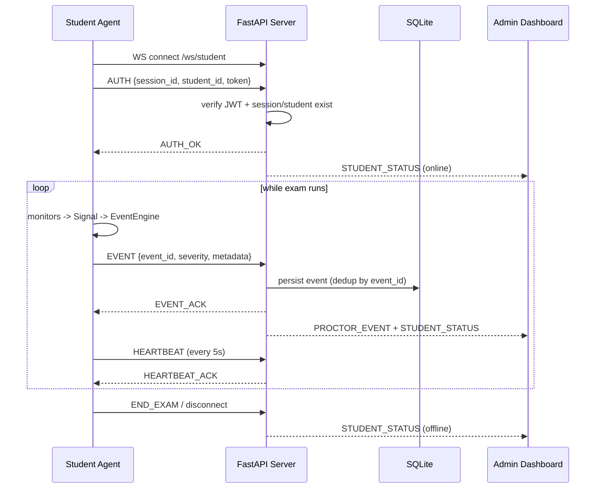

# Exam Proctoring System

A prototype real-time proctoring system for legitimate exam administration:
a lightweight **Student Agent** that runs on each student's own computer
during an exam, a **FastAPI server** that authenticates connections and
relays events, and an **Admin Dashboard** the proctor uses to monitor
everyone in real time.

The system is built around a hard constraint: it only monitors signals the
student has explicitly consented to, processes webcam video locally, and
never attempts to bypass OS security, read browser contents/passwords, or
touch anything beyond the current exam session. See
[Privacy & Consent](#privacy--consent) and [Technical Limitations](#technical-limitations)
before relying on this for anything beyond a prototype/demo.

## Contents

- [Architecture](#architecture)
- [Severity system](#severity-system)
- [Project structure](#project-structure)
- [Prerequisites](#prerequisites)
- [Setup: Server](#setup-server)
- [Setup: Student Agent](#setup-student-agent-macoswindowslinux)
- [Running a demo end to end](#running-a-demo-end-to-end)
- [WebSocket protocol](#websocket-protocol)
- [REST API](#rest-api-summary)
- [Docker](#docker)
- [Testing](#testing)
- [Reliability](#reliability)
- [Privacy & Consent](#privacy--consent)
- [Logging & diagnostics](#logging--diagnostics)
- [Technical limitations](#technical-limitations)

## Architecture

```text
┌─────────────────────┐      ┌─────────────────────┐      ┌─────────────────────┐
│   Student Agent 1   │      │   Student Agent 2   │      │   Student Agent N   │
│  Window Monitoring  │      │  Window Monitoring  │      │  Window Monitoring  │
│  Display Monitoring │      │  Display Monitoring │  ...  │  Display Monitoring │
│  Face/Gaze Detection│      │  Face/Gaze Detection│      │  Face/Gaze Detection│
│  Process Monitoring │      │  Process Monitoring │      │  Process Monitoring │
│  Event Engine        │      │  Event Engine        │      │  Event Engine        │
└──────────┬───────────┘      └──────────┬───────────┘      └──────────┬───────────┘
           │  WebSocket (wss://.../ws/student)                          │
           └───────────────────────────┬────────────────────────────────┘
                                        ▼
                       ┌───────────────────────────────┐
                       │        FastAPI Server          │
                       │  Auth (session+student+JWT)    │
                       │  Connection Registry            │
                       │  Event Validation & Persistence │
                       │  Event Broadcasting             │
                       │  Session / Evidence Management  │
                       │  SQLite (→ PostgreSQL later)     │
                       └───────────────┬─────────────────┘
                                        │  WebSocket (wss://.../ws/admin)
                                        ▼
                       ┌───────────────────────────────┐
                       │        Admin Dashboard          │
                       │  Student Grid / Status           │
                       │  Live Event Feed                 │
                       │  Student Detail / Timeline       │
                       │  Filtering                       │
                       └───────────────────────────────┘
```



### Components

- **Student Agent** (`student-agent/`) — Python + Tkinter desktop app. Shows
  a consent screen, then a small status window (session ID, student ID,
  connection/camera/monitoring status, current detected state, event count,
  End Exam button). Runs window, display, and webcam monitoring locally, and
  only emits derived *events* (never raw video) over the WebSocket.
- **Server** (`server/`) — FastAPI app: authenticates every connection,
  validates and persists events to SQLite, maintains an in-memory
  connection registry, and broadcasts live updates to every connected
  dashboard. Also serves the dashboard's static files at `/dashboard`.
- **Admin Dashboard** (`dashboard/`) — a single-page vanilla HTML/CSS/JS app
  (no build step). Connects to the server's admin WebSocket for live
  updates and to its REST API for historical timelines/evidence.

## Severity system

Three levels, used consistently across the agent, server, and dashboard
(this supersedes the ad-hoc "medium"/"high" labels sometimes used as
shorthand when talking about events informally):

| Severity | Meaning | Examples |
|---|---|---|
| 🟢 `green` | Normal | face present, exam app focused |
| 🟡 `yellow` | Potentially suspicious, ambiguous | brief window change, momentary face loss, short look-away, camera hiccup |
| 🔴 `red` | High-confidence anomaly, needs review | persistent multiple faces, persistent display mirroring, repeated app switching |

The agent's `EventEngine` auto-escalates a `yellow` condition to `red` if it
re-triggers **3 or more times in a row** (i.e. it's persistent, not a
one-off blip) — see `student-agent/events/engine.py`.

The dashboard never states a student is cheating. It shows: *"Potential
integrity issue detected — review recommended."*

## Bypass & mirroring detection

This is the layer most relevant if you're worried about a participant
routing the exam to another device or another person. Three independent
signals combine to cover this, all detection-only (nothing is blocked or
killed) and all built from the same constraint as everything else here: no
OS security bypass, no inspecting other devices.

| Signal | What it catches | Severity |
|---|---|---|
| `DISPLAY_MIRRORING_DETECTED` | The OS reports this display is mirrored to another (e.g. AirPlay/Miracast screen mirroring, which registers as a real display at the OS level) | 🔴 red, immediately |
| `EXTERNAL_DISPLAY_DETECTED` | A second display is connected (extended, not mirrored) | 🟡 yellow by default — set `TREAT_MULTI_DISPLAY_AS_CRITICAL=true` to make this 🔴 red immediately too |
| `REMOTE_ACCESS_TOOL_DETECTED` | A remote-control app is running (TeamViewer, AnyDesk, Splashtop, LogMeIn, GoToMyPC, common VNC servers, Chrome Remote Desktop host) — someone else could be watching or driving the machine | 🔴 red, immediately |
| `VIRTUAL_CAMERA_TOOL_DETECTED` | A virtual-camera driver is running (OBS Virtual Camera, Snap Camera, ManyCam, CamTwist, XSplit VCam, Iriun, DroidCam, EpocCam) — these can feed a fake image into the webcam check instead of the student's real feed | 🔴 red, immediately |

Unlike most other event types, these four go straight to **red** on first
occurrence instead of needing 3 repeats to escalate — there's no legitimate
reason for a remote-access tool or virtual-camera driver to be running
during a proctored session, so there's no ambiguity to wait out. Process
detection (`student-agent/monitors/process_monitor.py`) works by enumerating
running process *names* every `PROCESS_SCAN_INTERVAL_SECONDS` (default 5s)
— exactly what Activity Monitor/Task Manager/`ps` show any user, no
elevated access — and checking them against a configurable keyword list
(`REMOTE_ACCESS_PROCESS_KEYWORDS` / `VIRTUAL_CAMERA_PROCESS_KEYWORDS` in
`.env`, comma-separated). Common video-call apps (Zoom, Teams, Discord,
Meet) are deliberately **not** in the default list, since a study group may
legitimately want a call running alongside the session — add them yourself
if your group wants that flagged too.

**The hard limit, stated plainly:** none of this — nor any client-side
software, from any vendor — can detect a second *physical* device with no
software footprint on the monitored machine. A phone simply propped up and
pointed at the screen, or used for a voice call to relay answers, leaves
nothing for any local agent to find. Software-based detection raises the
bar against the common/easy methods (casting, remote control, faked webcam
feeds); it does not close that gap, and no honest description of any
proctoring tool should claim otherwise. Combine this with what it's
actually good for — a lightweight, transparent signal layer for a group
that's mostly trusting each other — rather than treating it as airtight.

## Project structure

```text
exam-proctoring/
├── student-agent/          # Desktop agent (Python + Tkinter)
│   ├── main.py
│   ├── config.py
│   ├── register_student.py # Proctor-run helper: enroll a student, print their token
│   ├── ui/app.py           # Consent dialog + status window
│   ├── monitors/
│   │   ├── window_monitor.py
│   │   ├── display_monitor.py
│   │   └── camera_monitor.py
│   ├── events/
│   │   ├── engine.py       # Debounce / cooldown / severity escalation
│   │   └── schemas.py
│   ├── networking/
│   │   ├── websocket_client.py   # Reconnect, durable local queue
│   │   └── evidence_uploader.py
│   └── requirements.txt
│
├── server/
│   ├── main.py
│   ├── config.py
│   ├── api/                # REST: sessions.py, evidence.py, events.py, health.py
│   ├── websocket/          # manager.py, student_ws.py, admin_ws.py
│   ├── database/db.py
│   ├── models/models.py    # SQLAlchemy ORM
│   ├── schemas/schemas.py  # Pydantic wire schemas + enums
│   ├── auth/tokens.py
│   ├── Dockerfile
│   └── requirements.txt
│
├── dashboard/
│   ├── index.html
│   ├── app.js
│   └── styles.css
│
├── tests/
│   ├── server/              # pytest + FastAPI TestClient
│   └── agent/                # pytest, mocked camera/window/display inputs
│
├── pytest.ini
├── docker-compose.yml
└── README.md
```

## Prerequisites

- Python **3.11+** on every machine running the server or an agent (this
  repo was built and tested against 3.12; MediaPipe does not yet support
  3.14, so if your system Python is newer, install 3.12 alongside it — see
  below).
- macOS / Windows / Linux for the Student Agent (platform-specific
  monitoring code, see [Setup: Student Agent](#setup-student-agent-macoswindowslinux)).
- A webcam for face/gaze monitoring (optional — the agent runs fine with
  `--no-camera`, it just won't produce face/gaze signals).

If your default `python3` is too new for MediaPipe (3.14+ at time of
writing), install 3.12 separately, e.g. on macOS: `brew install python@3.12`,
then use `python3.12 -m venv .venv` in the steps below instead of `python3`.

## Setup: Server

Works the same on macOS, Windows, and Linux — it's pure Python + SQLite.

```bash
cd exam-proctoring/server
python3.12 -m venv .venv
source .venv/bin/activate        # Windows: .venv\Scripts\activate
pip install -r requirements.txt
cp .env.example .env             # then edit JWT_SECRET / ADMIN_API_KEY for anything beyond local use
python main.py                   # or: uvicorn main:app --reload
```

The server listens on `http://localhost:8000`. Health check:
`curl http://localhost:8000/api/health`. The dashboard is also served
directly from the server at `http://localhost:8000/dashboard/index.html`
(or open `dashboard/index.html` via any static file server / `file://`).

### Create an exam session and enroll students (proctor-side)

```bash
curl -X POST http://localhost:8000/api/sessions \
  -H "X-Admin-Api-Key: CHANGE_ME_ADMIN_KEY" -H "Content-Type: application/json" \
  -d '{"name": "CS101 Midterm", "session_id": "exam_101"}'

curl -X POST http://localhost:8000/api/sessions/exam_101/students \
  -H "X-Admin-Api-Key: CHANGE_ME_ADMIN_KEY" -H "Content-Type: application/json" \
  -d '{"session_id": "exam_101", "student_id": "student_1", "display_name": "Alex Kim"}'
```

The enroll call returns a short-lived `token` (JWT, `STUDENT_TOKEN_TTL_MINUTES`
minutes) the Student Agent needs to connect. `student-agent/register_student.py`
wraps this same call and prints a ready-to-run agent command:

```bash
cd exam-proctoring/student-agent
python register_student.py --server http://localhost:8000 --admin-key CHANGE_ME_ADMIN_KEY \
  --session-id exam_101 --student-id student_1 --student-name "Alex Kim"
```

## Setup: Student Agent (macOS/Windows/Linux)

```bash
cd exam-proctoring/student-agent
python3.12 -m venv .venv
source .venv/bin/activate        # Windows: .venv\Scripts\activate
pip install -r requirements.txt
python main.py --server ws://localhost:8000 --http-server http://localhost:8000 \
  --session-id exam_101 --student-id student_1 --token <token from enrollment>
```

A consent dialog appears first — monitoring does not start until the
student clicks **"I Consent — Begin"**. The status window then shows
connection/camera/monitoring state, current detected state, and an event
counter, with an **End Exam** button that gracefully disconnects.

### macOS

- Install Tkinter if using Homebrew Python: `brew install python-tk`.
- **Camera**: the OS will prompt for Camera access the first time OpenCV
  opens the webcam. If denied, camera monitoring reports `CAMERA_UNAVAILABLE`
  and the rest of the agent keeps working.
- **Window titles**: reading the *title* of the frontmost window (not just
  its app name) uses `CGWindowListCopyWindowInfo`, which macOS gates behind
  the **Screen Recording** permission (System Settings → Privacy & Security
  → Screen Recording → enable for Terminal/your packaged app). Without it,
  the agent still reports the frontmost **application name** (no special
  permission needed for that) — window *titles* just come back empty. This
  is a real macOS restriction, not a bug.
- **Display detection**: uses public CoreGraphics APIs
  (`CGGetOnlineDisplayList`, `CGDisplayMirrorsDisplay`) via `pyobjc`; no
  extra permission needed.

### Windows

- Requires `pywin32` (in `requirements.txt`) for active-window detection.
- **Camera**: Windows will prompt for camera access on first use (Settings
  → Privacy → Camera must allow desktop apps).
- **Display mirroring detection** is best-effort: monitor *count* is always
  reliable (`GetSystemMetrics(SM_CMONITORS)`); exact clone-vs-extend
  topology detection via `QueryDisplayConfig` can vary across Windows builds
  — when it can't be determined precisely, the agent still reports the
  monitor count and flags multiple displays as "extended," with a note in
  the event metadata rather than silently guessing.

### Linux

- **Window monitoring** requires `xdotool` under an **X11** session
  (`sudo apt install xdotool`). Wayland does not expose the active window
  to ordinary applications at all — this is a Wayland platform restriction,
  not something this codebase can work around, and the agent reports
  `WINDOW_MONITOR_UNAVAILABLE` with a clear message rather than pretending
  to work.
- **Display detection** requires `xrandr` (typically preinstalled with
  Xorg); same X11-only caveat as above.
- **Tkinter**: `sudo apt install python3-tk`.

## Running a demo end to end

1. Start the server (above), create a session, enroll 2–3 students.
2. Launch a Student Agent per student (each in its own terminal/venv
   activation, using each student's own token), consent, and leave running.
3. Open the dashboard (`http://localhost:8000/dashboard/index.html`), enter
   the server URL, admin API key, and session ID, and click **Connect**.
4. Switch windows / cover the webcam / open a second display on a student's
   machine and watch the corresponding card, live event feed, and severity
   badges update in real time.

There's no built-in traffic generator in the deliverable, but
`tests/agent/test_websocket_client.py` and `tests/server/test_websocket.py`
exercise the same protocol end-to-end with fake WebSocket peers if you want
a scripted example to adapt.

## WebSocket protocol

**Student → Server** (`/ws/student`), first frame must be `AUTH`:

```json
{"type": "AUTH", "session_id": "exam_101", "student_id": "student_1", "token": "<jwt>"}
{"type": "EVENT", "payload": {"event_id": "...", "student_id": "...", "session_id": "...", "timestamp": "...", "event_type": "WINDOW_FOCUS_CHANGED", "severity": "yellow", "metadata": {}}}
{"type": "HEARTBEAT", "student_id": "student_1", "timestamp": "..."}
{"type": "CONSENT", "categories": ["window", "display", "camera"]}
{"type": "END_EXAM"}
```

**Server → Student**: `AUTH_OK` / `AUTH_FAILED` / `EVENT_ACK` (with
`duplicate: true|false`) / `HEARTBEAT_ACK` / `ERROR`.

**Server → Admin** (`/ws/admin?api_key=...`):

```json
{"type": "SNAPSHOT", "students": [...], "recent_events": [...]}
{"type": "STUDENT_STATUS", "student_id": "...", "status": "online", "overall_severity": "yellow", "alert_count": 2, "...": "..."}
{"type": "PROCTOR_EVENT", "payload": { "...": "event fields..." }}
```

**Admin → Server**: `{"type": "REQUEST_SNAPSHOT"}` and
`{"type": "ACK_STUDENT", "student_id": "..."}` (clears a student's alert
count/severity after proctor review).

Event types: `WINDOW_FOCUS_CHANGED`, `BROWSER_FOCUS_LOST`,
`APPLICATION_CHANGED`, `WINDOW_MONITOR_UNAVAILABLE`,
`DISPLAY_CONFIGURATION_CHANGED`, `DISPLAY_MIRRORING_DETECTED`,
`EXTERNAL_DISPLAY_DETECTED`, `DISPLAY_MONITOR_UNAVAILABLE`,
`FACE_PRESENT`, `ONE_FACE_DETECTED`, `NO_FACE_DETECTED`,
`MULTIPLE_FACES_DETECTED`, `FACE_AWAY`, `POSSIBLE_PROLONGED_ABSENCE`,
`CAMERA_UNAVAILABLE`, `PROLONGED_LOOK_AWAY`, `REMOTE_ACCESS_TOOL_DETECTED`,
`VIRTUAL_CAMERA_TOOL_DETECTED`, `PROCESS_MONITOR_UNAVAILABLE`,
`MONITORING_PERMISSION_DENIED`, `STUDENT_CONNECTED`,
`STUDENT_DISCONNECTED`, `EXAM_STARTED`, `EXAM_ENDED`
(full source of truth: `events/schemas.py` in each component).

## REST API summary

All proctor/admin endpoints require `X-Admin-Api-Key: <ADMIN_API_KEY>`.

| Method | Path | Purpose |
|---|---|---|
| POST | `/api/sessions` | Create an exam session |
| POST | `/api/sessions/{id}/end` | Mark a session ended |
| GET | `/api/sessions` | List sessions |
| POST | `/api/sessions/{id}/students` | Enroll a student, get a token |
| GET | `/api/sessions/{id}/students` | List students + live status |
| GET | `/api/events?session_id=...` | Query event history (filter by student/type/severity/time) |
| POST | `/api/evidence` | (agent-authenticated, not admin) upload one snapshot |
| GET | `/api/evidence?session_id=...` | List evidence for a session/student |
| GET | `/api/evidence/{id}` | Fetch one evidence image |
| GET | `/api/health` | Liveness + connection counts |

## Docker

Only the **server** is containerized — the Student Agent needs direct OS
access to the local camera/window/display and has to run natively on each
student's machine.

```bash
docker compose up --build
```

Serves the API + dashboard at `http://localhost:8000`. Edit the
`environment:` block in `docker-compose.yml` (or uncomment `env_file:` and
create `server/.env` from `server/.env.example`) before using this for
anything beyond local evaluation — the defaults are dev-only placeholders.

> This Dockerfile/compose config follows the same relative-path layout
> verified by the local (non-Docker) run in this repo, but Docker itself was
> not available in the environment this project was built in, so the image
> build has not been executed end-to-end — check `docker compose up --build`
> output before relying on it.

## Deploying for a remote study group

If people are connecting from their own homes/networks (not one shared
LAN), the **server** needs a real internet-reachable URL. **Not Vercel**:
this app is a persistent process with an in-memory connection registry and
a WebSocket server — Vercel's serverless functions are stateless/ephemeral
(no long-running process, no persistent filesystem), which breaks both the
live broadcast mechanism and SQLite/evidence storage. The **Dashboard**
alone (static files) would work fine on Vercel, but there's no reason to
split it out — the server already serves it at `/dashboard`, so students
and the proctor only need one URL.

Any host that runs a persistent Docker container with WebSocket support and
a mountable volume works: **Railway**, **Fly.io**, and **Render** (paid
tier — its free tier sleeps after 15 minutes idle, which would drop live
connections mid-session) are the common low-effort choices. Below is the
walkthrough for **Railway**, since `railway.toml` is already set up for it
in this repo; the same environment variables and volume-mount idea apply
to any of the others.

1. **Create a Railway account** and install the CLI (`npm i -g @railway/cli`
   or see railway.app/cli), then from the `exam-proctoring/` directory:

   ```bash
   railway login          # opens a browser to authenticate
   railway init            # create a new Railway project
   railway up               # builds server/Dockerfile and deploys it
   ```

   (Railway also supports connecting a GitHub repo for auto-deploy on push,
   via their dashboard, if you'd rather not use the CLI.)

2. **Set environment variables** (Railway dashboard → your service →
   Variables, or `railway variables --set KEY=VALUE`). At minimum:

   ```text
   JWT_SECRET=<output of: python -c "import secrets; print(secrets.token_urlsafe(48))">
   ADMIN_API_KEY=<a second random value, same command>
   DATABASE_URL=sqlite:////app/server/storage/proctoring.db
   EVIDENCE_STORAGE_DIR=/app/server/storage/evidence
   ```

   Generate two *different* random values — never reuse the `CHANGE_ME_*`
   defaults or commit real secrets to the repo.

3. **Attach a persistent volume** (Railway dashboard → your service →
   Volumes → New Volume) mounted at `/app/server/storage`. Without this,
   the SQLite database and evidence snapshots would be wiped on every
   redeploy/restart, since a container's own filesystem isn't persistent.

4. **Generate a public domain** (Settings → Networking → Generate Domain).
   Railway terminates TLS for you automatically, so you get both
   `https://your-app.up.railway.app` and (same host) `wss://your-app.up.railway.app`
   with no certificate setup on your end.

5. **Verify it's up**: `curl https://your-app.up.railway.app/api/health`.

6. **Point everyone at it.** The dashboard is at
   `https://your-app.up.railway.app/dashboard/index.html` (enter that same
   host as the "Server URL" in the connect screen — the dashboard converts
   `https://` to `wss://` itself). Each student's agent needs:

   ```bash
   python main.py --server wss://your-app.up.railway.app \
     --http-server https://your-app.up.railway.app \
     --session-id exam_101 --student-id student_1 --token <their token>
   ```

   The agent itself still always runs natively on the student's own
   machine — moving the server to the cloud doesn't change that part.

**Cost**: this is a tiny single-instance service (SQLite, no separate DB
server) — Railway/Fly.io/Render's smallest paid tier (roughly $5–7/month,
some with a starter free credit) comfortably covers a study group. Turn
the service off between sessions if you want to avoid any ongoing cost.

## Testing

The server and agent have separate dependency sets (and both define a
top-level `config.py`), so they're tested with two separate `pytest`
invocations, each using its own venv — matching how they're actually
deployed as independent components:

```bash
# Server suite (auth, DB persistence, WebSocket protocol, duplicate
# suppression, heartbeat timeout) - uses FastAPI's in-process TestClient,
# no real network ports.
cd server && source .venv/bin/activate
cd .. && python -m pytest tests/server -v

# Agent suite (EventEngine debounce/severity escalation, window/display
# state-transition classification, camera threshold logic with mocked
# MediaPipe results, WebSocket client reconnect/durable-queue behavior
# against a real local WebSocket test server) - no physical webcam needed.
cd student-agent && source .venv/bin/activate
cd .. && python -m pytest tests/agent -v
```

## Reliability

- **Server restart**: students detect the dropped connection and
  reconnect with exponential backoff; already-online dashboards get a fresh
  `SNAPSHOT` on their next reconnect (or `REQUEST_SNAPSHOT` on demand).
- **Dashboard refresh**: reopens the WebSocket and receives a full
  `SNAPSHOT`, so no state is lost.
- **Student network drop**: events created while offline are queued
  locally (in-memory *and* persisted to `agent_event_queue.jsonl`, so they
  survive an agent process restart too) and resent once reconnected. The
  server deduplicates by `event_id`, so a resend never produces a duplicate
  event.
- **Webcam becomes unavailable**: a single `CAMERA_UNAVAILABLE` event is
  emitted (not one per failed frame) and the agent keeps retrying to reopen
  the camera in the background; window/display monitoring and the
  connection itself are unaffected.
- **Heartbeat timeout**: if the server stops receiving heartbeats/events
  from a student for `HEARTBEAT_TIMEOUT_SECONDS` (default 20s), it marks
  that student offline and notifies dashboards, even if the socket itself
  hasn't errored out yet.

## Privacy & Consent

- **Explicit consent before monitoring starts**: the agent shows a consent
  screen listing every category of data collected (window/app name,
  display configuration, locally-processed webcam video, occasional
  snapshot images, heartbeat) before opening any connection or touching the
  camera.
- **Visible monitoring indicator**: a persistent "● MONITORING ACTIVE"
  banner stays on screen for the whole exam.
- **Local-first processing**: face/gaze detection runs on the student's own
  machine; raw video is never streamed to the server.
- **Minimum necessary data**: only derived events (type, severity,
  small metadata dict) are sent, not continuous telemetry.
- **Evidence retention**: snapshots (only captured for high-severity
  events, at most one still image, JPEG-compressed) are deleted
  automatically after `EVIDENCE_RETENTION_HOURS` (default 72h) by a
  background purge task.
- **No hidden or post-exam monitoring**: clicking **End Exam** stops every
  monitor and closes the connection; nothing runs in the background
  afterward. Never stores passwords, browser contents/history, keystrokes,
  or clipboard contents.

## Logging & diagnostics

Both components use Python's `logging` module with structured, leveled
messages (never raw webcam frames or unnecessary personal data) covering
startup, camera initialization, permission failures, WebSocket
connect/reconnect, event generation/transmission, server errors, and exam
termination. Agent logs go to `student-agent/agent.log` (rotating, 2MB ×
3 backups) and stdout; server logs go to stdout (redirect as needed in
your deployment).

## Technical limitations

This system reports **signals for human review**, not verdicts. Be
specific with users about what it can and can't actually tell you:

- OS window/display APIs vary by platform and version; behavior described
  above (screen recording permission on macOS, Wayland on Linux, topology
  detection on Windows) is a platform constraint, not a bug in this code.
- Window titles/application names may legitimately be unavailable
  (permission denied, unusual window managers, remote desktop sessions).
- Display mirroring/multi-display detection describes **this machine's own
  reported configuration only** — it cannot see or infer what is actually
  rendered on another physical device, and it does not prove a second
  device was used to view exam content.
- Face detection has false positives and negatives, especially in poor
  lighting or with an unusual camera angle.
- Head-pose ("looking away") estimation here is a basic geometric estimate
  (`solvePnP` against a generic face model), not calibrated eye-tracking —
  looking away from the screen does not, by itself, indicate cheating.
- Network failures can delay real-time reporting; the local queue makes
  delivery eventually-consistent, not instantaneous.
- Severity escalation (yellow → red after repeated occurrences) is a
  heuristic tuned for this prototype, not a validated risk model.
